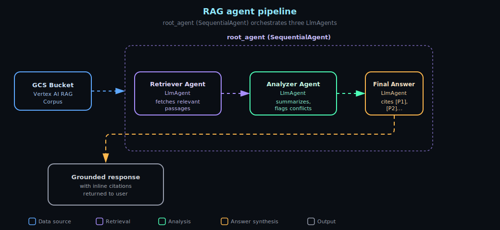

## Introduction

This project implements a `SequentialAgent` that orchestrates three `LlmAgent` agents in a retrieval-augmented generation (RAG) pipeline:

| Agent | Type | Role |
|---|---|---|
| Retriever Agent | `LlmAgent` | Calls Vertex AI RAG to fetch contextually relevant passages from a structured corpus |
| Analyzer Agent | `LlmAgent` | Interprets and summarizes retrieved text, highlighting key points, conflicts, and evidence |
| Final Answer Agent | `LlmAgent` | Constructs a human-readable response with inline citations (`[P1]`, `[P2]`), grounding every claim in the retrieved evidence |
| `root_agent` | `SequentialAgent` | Orchestrates the three `LlmAgent` agents above |



## Setup

### 1. Create the corpus and ingest data

1. Copy your data files into a GCP storage bucket, identified in the `.env` file as `GCS_URI`.
2. Set the `GOOGLE_CLOUD_PROJECT` and `GOOGLE_CLOUD_LOCATION` parameters in your `.env` file.
3. Set `GOOGLE_GENAI_USE_VERTEXAI` to `True`.
4. Run the setup script:

```bash
   python adk-rag-agent/create_database/create_corpus_and_vector_database.py
```

   This initializes the Vertex AI client, creates the corpus, and downloads/uploads the data to it.

### 2. Run the agent

From the root project directory, choose one of the following:

**Option A — CLI:**
```bash
adk run adk-rag-agent
```

**Option B — ADK Web UI:**
```bash
adk web
```
Then select `adk-rag-agent` from the dropdown and start interrogating the agents.

